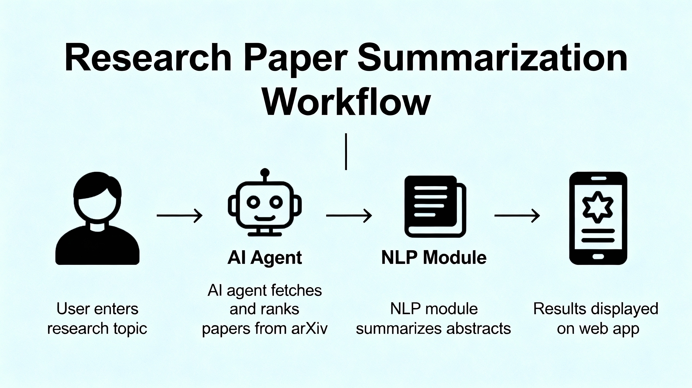

# Research Paper Suggestion AI Agent
_Automating literature discovery and summarization for MSc students_

This Streamlit web app helps students and researchers find and review academic papers with ease. Enter any topic or question, and the agent fetches top papers from arXiv, ranks them, and creates concise summaries using state-of-the-art NLP.

**Features**
- Intuitive web interface
- Searches live arXiv database (free, open access)
- Summarizes abstracts automatically
- Fast results

**Demo**
- Example query:  
   > quantum machine learning  
   See top-ranked papers, authors, links, and summaries instantly!

**How to Use**
1. Clone this repository  
   `git clone https://github.com/yourusername/research-paper-suggestion-app.git`
2. Install dependencies  
   `pip install -r requirements.txt`
3. Launch the app  
   `streamlit run app.py`
4. Enter a topic, get results!

**Technologies Used**
- Python, Streamlit
- arXiv API
- Hugging Face transformers (BART)

**Attribution**
Powered by arXiv.org

**License**
MIT License (see LICENSE)

**Future Improvements**
- Semantic ranking and personal reading lists
- User authentication
- Integration with other APIs

**Contact**
Author: Deepu P  
GitHub: Deepu-p-123
